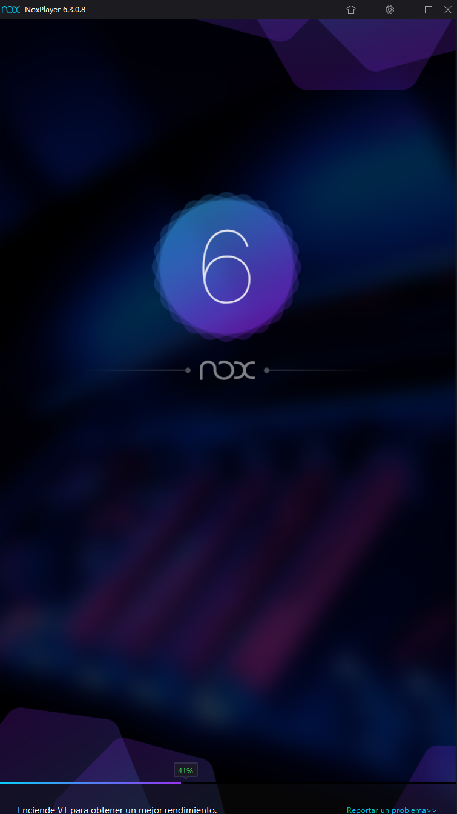
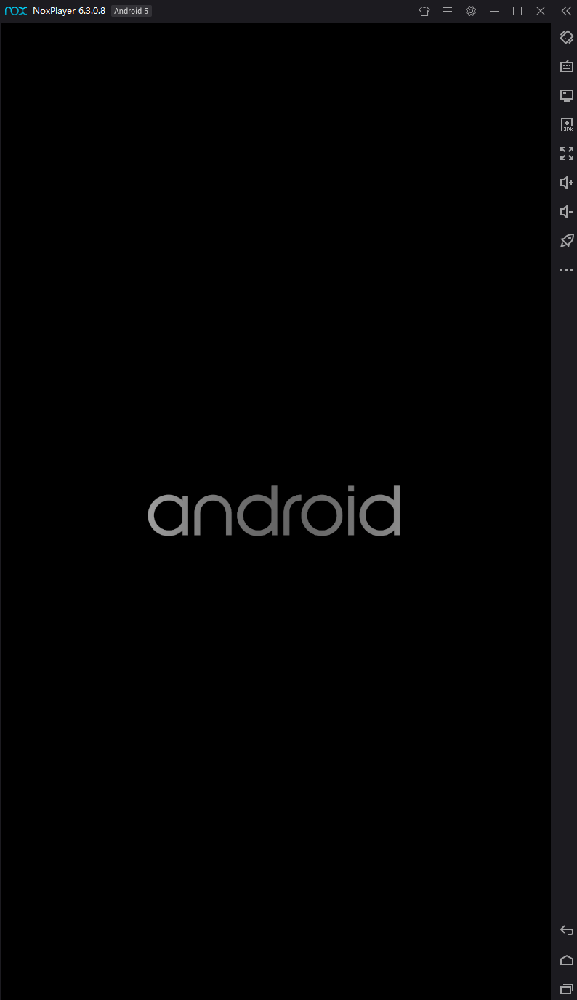
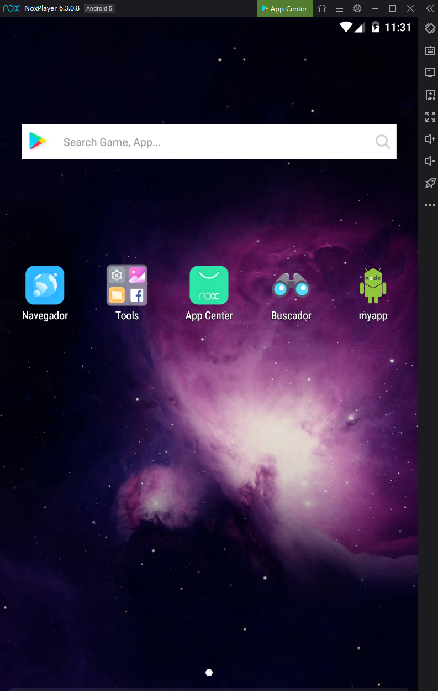
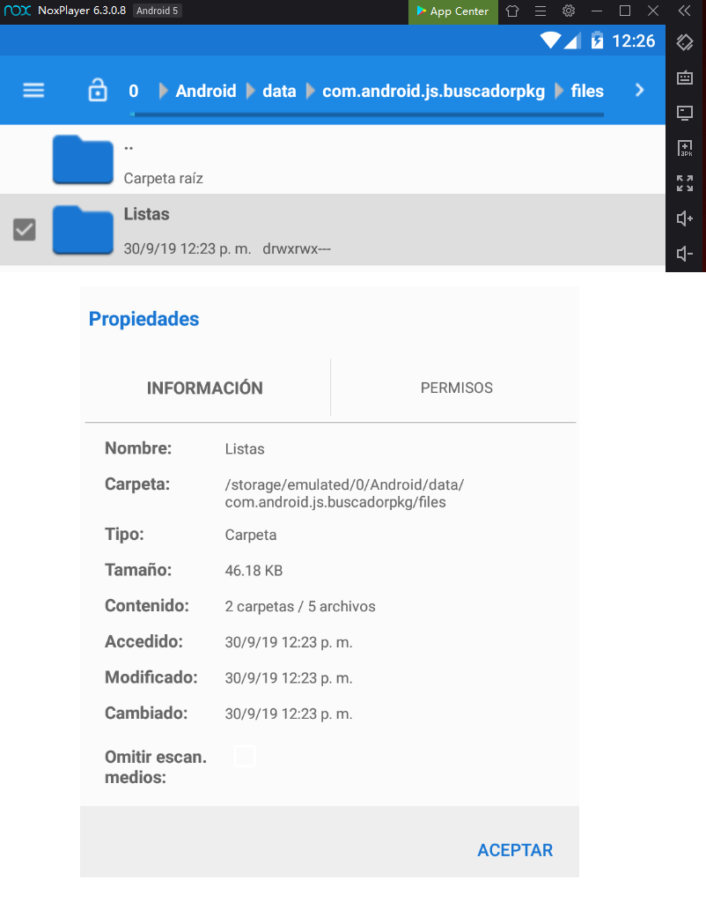
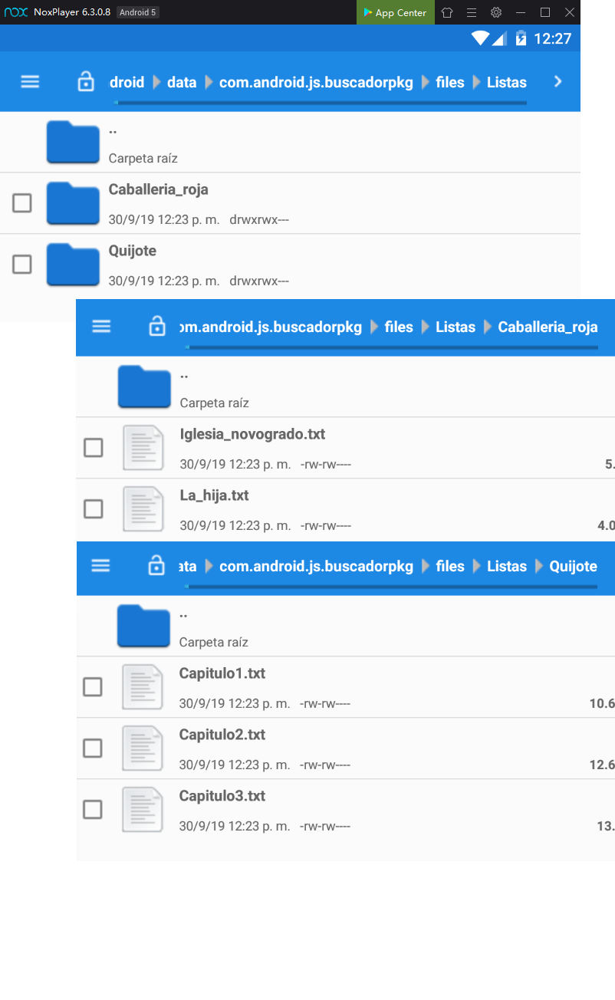
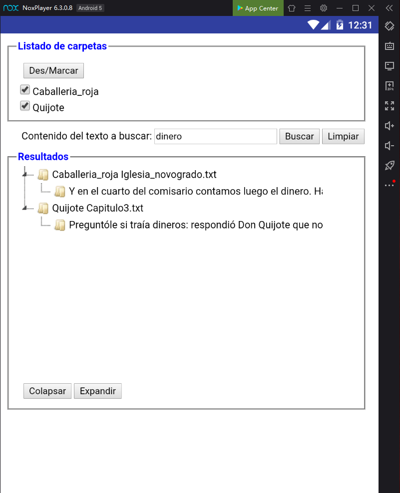
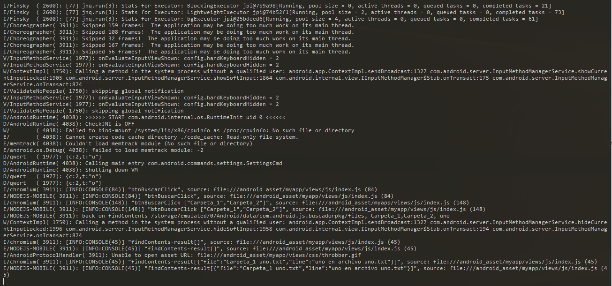

### NODEJS_ANDROIDJS-find-in-files
Proyecto para Android realizado en Nodejs que permite buscar un texto sobre archivos situados en unas carpetas determinadas.

Ref: 
https://android-js.github.io/
https://blog.usejournal.com/how-to-build-android-apps-with-node-js-using-android-js-2aa4643be87b 
https://github.com/android-js

#### Comandos

* Instalacion
NOTA: Probado con la version 2.0.2 de androidjs-builder
Ref: https://www.npmjs.com/package/androidjs-builder 
    ` npm i -g androidjs-builder `

* Construir proyecto
    ` androidjs b `

Genera un archivo apk en la carpeta dist

### NOTA IMPORTANTE
Requiere tener instalado jdk 64bits (ejemplo .. jre-8u221-windows-x64.exe)
En java de 32 bits no funciona con apktools 2.4.0

## Emulador Android: NOX
Ref: 
https://beebom.com/best-android-emulators-windows/

https://www.bignox.com/#p1  nox_setup_v6.3.0.8_full_intl.exe

NOX para que funcione se debera deshabilitar el modo Hyper-V sino dara error con pantallazo azul en Windows 10

## Ejecucion en Android:

1. Arranque de NOX
     
    <br/>

2. Pantalla principal
    
    <br/>

3. Ruta de las carpetas de busqueda (carpeta por defecto):
Se crean las carpetas y ficheros
    ` storage/emulated/0/Android/data/com.android.js.buscadorpkg/files/Listas`

    
    <br/>
    

4. Ejecucion del programa a traves del enlace "Buscador" situado en la pantalla principal

    
    <br/>

Dentro de la carpeta "Listas" existirán 1 o n subcarpetas que se cargarán en la parte superior de la app ("Listado de Carpetas").
Posteriormente el usuario selecionará las subcarpetas donde quiere realizar la busqueda, y el texto a buscar.
El sistema buscara el texto dentro de los archivos contenidos en las subcarpetas seleccionadas.

## Depuracion en el emulador NOX:
Ref: https://stackoverflow.com/questions/38477795/how-to-use-adb-with-emulator-like-memu-bluestacks-nox-app-player

1. Ir a la carpeta de NOX ... 
D:\Program Files\Nox\bin

2. Ver la lista de dispositivos
``` 
    D:\Program Files\Nox\bin
    nox_adb.exe devices
    List of devices attached
    127.0.0.1:62001 device
``` 

3. Habilitar modo depuracion en el Android de NOX
    - Ajustes
    - Pulsar varias veces sobre la opcion "Acerca del telefono" hasta que se habilite la opcion de Depuracion
    - Ir a "Herramientas de desarrollador" y habilitar "Depuracion USB"
    - Reiniciar el emulador NOX

4. Conectar NOX por ADB
``` 
    nox_adb connect 127.0.0.1:62001
    connected to 127.0.0.1:62001
```     

5. Entrar en el SHELL
``` 
    adb shell
    root@android:/ #
``` 

6. Ver los logs
`adb logcat `

    <br/>
    

## Otro metodo de depuracion (no probado)
` weinre `

Ref: https://people.apache.org/~pmuellr/weinre/docs/latest/Home.html
